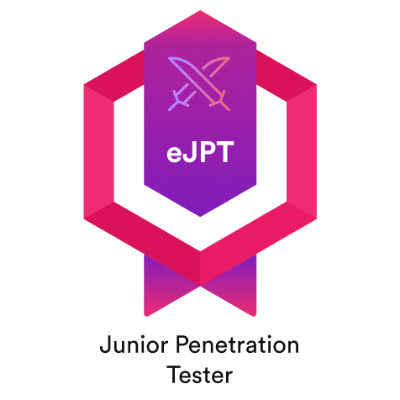
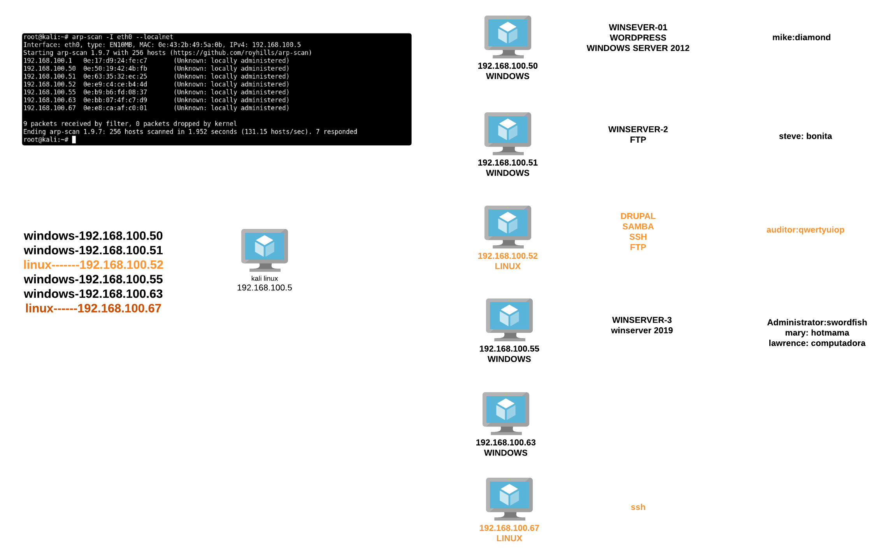

# 📝 eJPTv2-Examen

<figure><figcaption>
eJPT - © eLearnSecurity | INE
</figcaption></figure>

## Duración del curso y temas ⏳📚
 ⏳📚 

\~ 145 hours (_`~56h of videos`_)Actividades: **4** secciones , **12** videos, **154** cuestionarios, **120** labs

* ​[**Assessment Methodologies & Auditing (25%)**]() 
* [​**Host & Network Penetration Testing (25%)** ]()
* [​**Host and Network Penetration Testing (35%)** ]()
* [​**Web Application Penetration Testing (15%)** ]()

## ​[eJPT]() Examen 📄🖊️ 

* Time limit: 2 days (**48 hours** lab on)
* Questions: **35**
* Expiration date: yes (3 years)
* Objectives:
  * **Assessment Methodologies Domain (25% of exam):**
    * Evaluate information and criticality or impact of vulnerabilities
    * Identify open ports and services on a target
    * _Exam Score to pass_: at least **`90%`**
  * **Host and Network Auditing Domain (25% of exam):**
    * Gather hash/password information from target
    * Enumerate network information from files on target
    * _Exam Score to pass_: at least **`80%`**
  * **Host and Network Pen Testing Domain (35% of exam):**
    * Conduct brute-force password attacks
    * Conduct exploitation with Metasploit
    * _Exam Score to pass_: at least **`70%`**
  * **Web Application Pen Testing Domain (15% of exam):**
    * Exploit web app vulnerabilities
    * Locate hidden files and directories
    * _Exam Score to pass_: at least **`60%`**
* _Overall Exam score_: **at least `70%` + above minimum score requirements in each domain section**
* From a **technical perspective** the exam is set out to simulate a black box penetration test
  * minimal amount of information about the target network
  * in browser labs (no vpn)
  * a complete unrestricted access to the lab environment for the entire duration of the exam
  * letter of engagement
* Flexible structure for the user
* Hands-on, open book
* **Dynamic flags**: randomly generated flags injected into the lab environment
* Testing your ability to **find the answer**. How you do it is up to you.

## Resources 📑📘

<figure><figcaption>
Examen 2024 eJPT v2
</figcaption></figure>